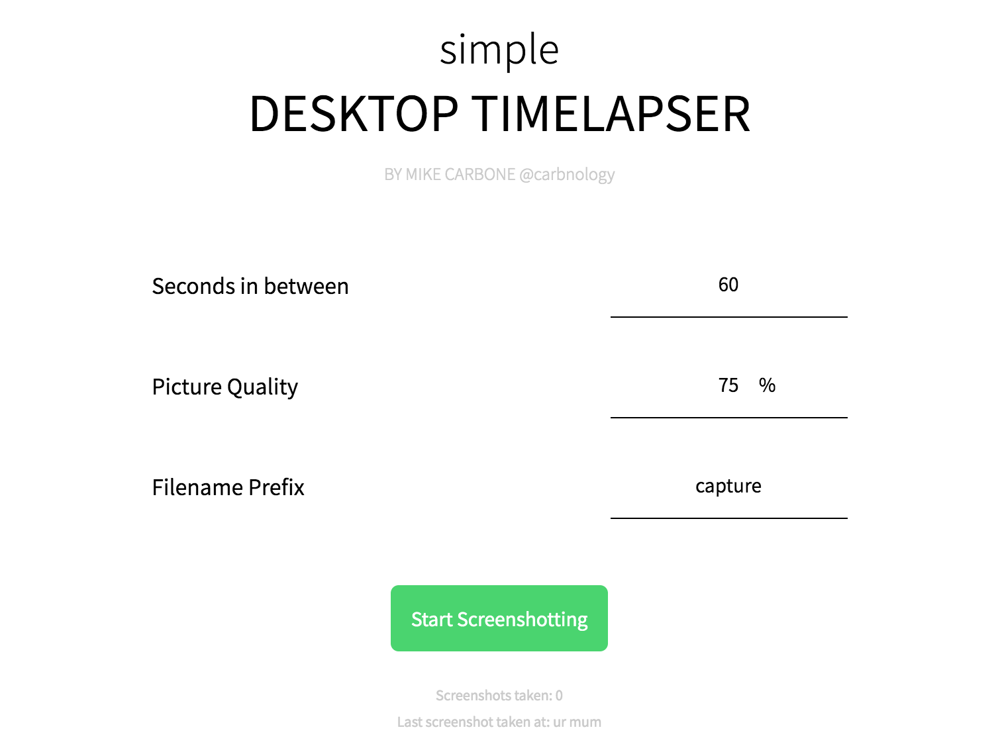

# Simple Desktop Timelapser

Simple Desktop Timelapser was developed to easily create timelapses as I work.
The app will take a screenshot every x seconds, which can then be combined to create HD timelapses.

Developed with Electron.

## Development
- `git clone https://github.com/carbonology/SimpleDesktopTimelapser.git`
- `npm install`
- `npm run start`